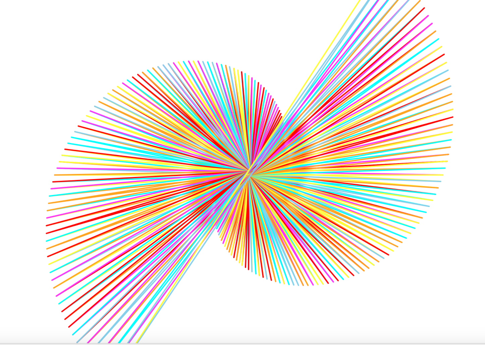

# ulam

choice the angle,the length,the duration and the colors of the turtle in your terminal and make your own personalised ulam spiral 
dont want to download it? 
run code [here](https://repl.it/join/lfngbbgy-simsalabim1) 
